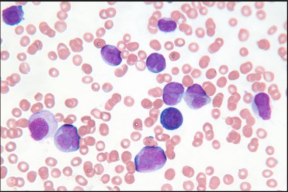
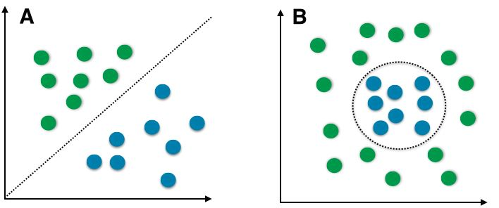

# Breast Cancer Detection

- Cancer Detection is a one of the most resarched topic in not only in field of Medicine but also in Instrument technology and machine learning.
- Among all types of cancer breast cancer has the maximum share.
- With increase in unhealtty lifesytle and polluting envioronment it has been more important than ever to study and diagnose.
- Despite efforts on part of various agenices many lifes are lost to the deadly cause. 

According to WHO there are about 1.38 million new cases and 458 000 deaths from breast cancer each year (IARC Globocan, 2008)

## Methodlogy of Data Collection

- The methodlogy used to collect data is Fine-needle aspiration (FNA). FNA is a diagnostic procedure used to investigate lumps or masses. In this technique, a thin (23–25 gauge), hollow needle is inserted into the mass for sampling of cells that, after being stained, will be examined under a microscope (biopsy).
- Fine-needle aspiration biopsies are very safe minor surgical procedures. Often, a major surgical (excisional or open) biopsy can be avoided by performing a needle aspiration biopsy instead, eliminating the need for hospitalization. In 1981, the first fine-needle aspiration biopsy in the United States was done at Maimonides Medical Center.[1] Today, this procedure is widely used in the diagnosis of cancer and inflammatory conditions

## Classification Problem

- In Machine learning the output of detection for any disease is considered in binary format, i.e With the given data set/input data of subject/patient will infected with the given disease or not. 
- The given data or the input data is nothing but the test results that are conducted while examining the patient.

## Data set

- The dataset consist of features which are computed from a digitized image of a fine needle aspirate (FNA) of a breast mass. They describe characteristics of the cell nuclei present in the image.

- Dataset has been downloaded from UCI Machine Learning Repository: https://archive.ics.uci.edu/ml/datasets/Breast+Cancer+Wisconsin+%28Diagnostic%29

- Attribute Information:

- 1) ID number 
- 2) Diagnosis (M = malignant, B = benign) 

- Ten real-valued features are computed for each cell nucleus  
-- radius (mean of distances from center to points on the perimeter)
-- texture (standard deviation of gray-scale values)
•perimeter
•area 
•smoothness (local variation in radius lengths) 
•compactness (perimeter^2 / area - 1.0)
•concavity (severity of concave portions of the contour)
•concave points (number of concave portions of the contour)
•symmetry
•fractal dimension ("coastline approximation" - 1)

- The mean, standard error and "worst" or largest (mean of the three largest values) of these features were computed for each image, resulting in 30 features. For instance, field 3 is Mean Radius, field 13 is Radius SE, field 23 is Worst Radius.

- All feature values are recoded with four significant digits.

- Missing attribute values: none

- Class distribution: 357 benign, 212 malignant

