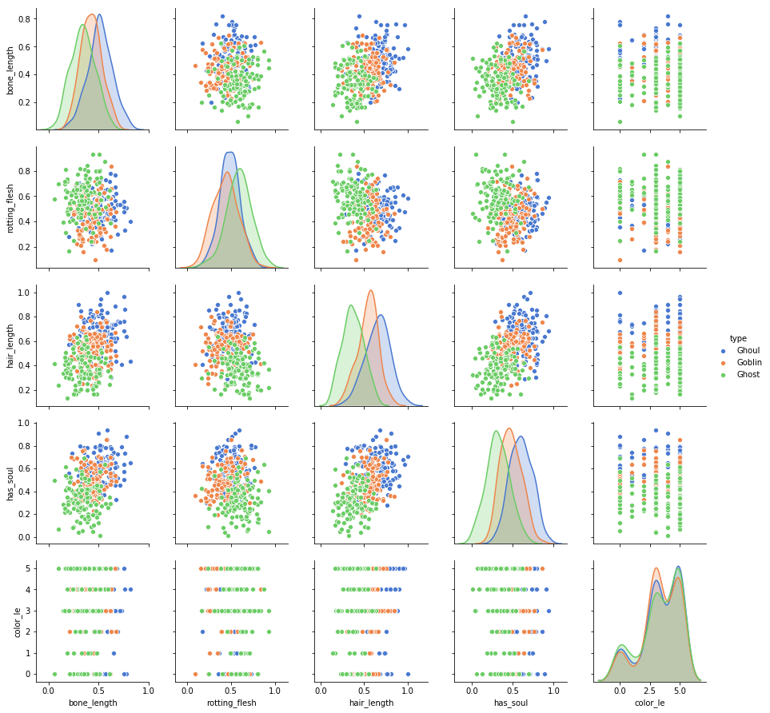

# Character Detection
  
- Character Detection or Character identification draws its roots from the most primitive problems in machine learning i.e ___Classification___. 
- It is one of the arena of Machine learning wherein it is possible to identify an object or predict the outcome based on the similar inputs features that we have understood /trained earlier.

### Problem Statement
  
- The data set here attempts to distinguish between the three characters, i.e __Ghouls, Goblin & Ghosts__ based upon the bone,flesh,soul and color.
- _Ghouls, Goblin & Ghosts_ are mostly related with Halloween characters. Ghouls who are considered to be evil spirt, Goblins are mischievous, ugly creatures. Ghosts on other hand are sprits who are yet to take a new form of life.

### Data set
- Data set provided has different train and test datasets. The train dataset has 371 not null records and the test dataset has 529 not null records.
- The input parameters are bone_length,rotting_flesh,hair_length,soul,color.
- Bone_length, rotting_flesh, hair_length,soul are numerical continuous parameters.
- Color is the only input parameters that is categorical.
- The output i.e characters Ghouls, Goblin & Ghosts are also categorical.

### Exploratory Data Analysis
  
- None of the dependent parameters i.e bone_length,rotting_flesh, hair_length, soul and color are highly co-related with each other
- The dependent parameters show normal distribution by large and hence are very less skewed.

  
- The input parameters are normally distributed with respect to character type, and not large number of outliers are existent.

  
- Hair length is least number of outliers across all the 3 character type i.e 1, & rotting flesh is maximum outliers i.e 4. However, these corresponds to infinitely small percentage in dataset i.e  0.26 % and 1.07% respectively and hence can be ignored during modelling.
- From pair plot it is evident that all the 3 characters are quite neatly segregated with respect to inputs and not very much mixed with each other.
- Label encoder is used for color feature.

### Classifiers Used
- As we are dealing with classification problem, hence the following modeling techniques are deployed.
      
- In order to achieve best parameters for mentioned classifiers, grid search CV has been used.
- Further to get the best of all the classifiers Voting classifier has been used to get the maximum accuracy.

### Conclusion

- The following accuracies has been found with varies algorithms.
######    Decision Tree:                        60.2%
######    KNN + Grid Search CV :                68.7%
    Gradient Boost + Grid Search CV :     70.5%
    Bagging + Grid Search CV  :           71.9%
    RF + Grid Search CV :                 72.2%
    Logistic Regression + Grid Search CV :73.3%
    
- On using __voting classifier__ for mentioned algorithms, the accuracy is ___79.4%___

