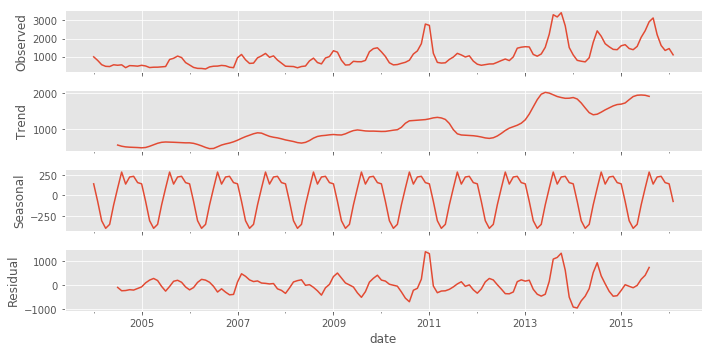
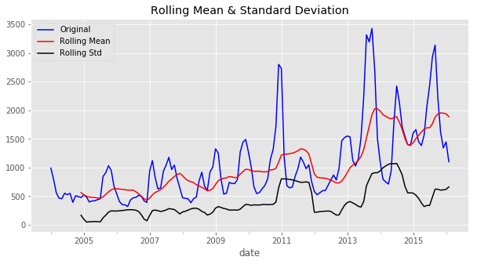

## Onion Prices Prediction using Time Series

#### What is time series ?
- Data collected on basis of time is Time series data. Apart from Time Series we have Cross Sectional data when multiple inputs are gathered at particular time interval.

#### Need of Time Series
- Study behaviour of data with respect to time.
- Analyze trend to forecast future.

#### When not to use Time series modelling
- Mean is 0
- Constant variance.
- Values of Time series can be re-presented as mathematical function.

#### Why do we use Time series modelling, 
- Time series modelling enables us to ___forecast the variable of interest(dependent variable Y) by using it's previous values as independent inputs___ to models such as AR,MA,ARMA and ARIMA.
- Mathematically, for an univariate time series we tend to predict the value of y(t) , based upon y(t-1), y(t-2) and y(t-n).

## Data Set:
- In late 2010, Onion prices shot through the roof and causing grave crisis. Apparently the crisis was caused by lack of rainfall in major onion producing region - Maharashtra and Karnataka and led to large scale hoarding by the traders. The crisis caused political tension in the country and described as "a grave concern" by then Indian Prime Minister Manmohan Singh.
- •BBC Article in Dec 2010 - https://www.bbc.co.uk/blogs/thereporters/soutikbiswas/2010/12/indias_onion_crisis.html 
- •Hindu OpEd in Dec 2010 - https://www.thehindu.com/opinion/editorial/The-political-price-of-onions/article15607000.ece
- The purpose of this assignment is to predict the price of onion in Bangalore using ARIMA.
- Below are featues of the data set
> - market : Name of Market.
> - month : Month of year.
> - year : Year
> - quantity : In tonnes
> - priceMin : Minimum price
> - priceMax : Maximum price
> - priceMod : Price medium.
> - state : Location
> - city : City
> - timeIndex : Nos of Days.
> - date: Date

  

## Components of Time series
- Time series has four components, 
- Trend (T) 
-	Enables to get the particular pattern over a period of time.i.e the data is in uptrend, download or sideways
-Seasonality (S)
-	Enables to observe effect of season or pattern at regular interval,It is a periodic patterm for eg, sales of ice-cream in summer and woolen apparales in Winter.
-Cyclic (C)
-	Enables to identify a long term trend,it is a non-periodic i.e depression, recession.
-Random/Irregular. (R)
-	Unexpected spike or variation in Time series data.

  

#### White noise:
- When data or Time series has all variables with same variance (sigma^2) and each value has a zero correlation with all other values in the series

#### Concept of stationarity:
-	Time Series is considered to be stationarity whose statistical properties such as mean, variance, autocorrelation are all constant over time.
-	It is checked by below methods, 
		- Rolling mean : It is more of visual method, to check that mean, variance and co-variance does not varies with time.
		- ADF test. ADF test starts with assumption of TS being non-stationary, The TS is only decleared to be stationary when the Test Statistic is < critical values.

- In the given data set, we can see that TS < 1%, 5% and 10% of critical values and confirm that the given Time series is stationaty.
> - Result of ADF test:
> - Test Statistic                  -4.004401
> - p-value                          0.001388
> - #Lags Used                       2.000000
> - Number of Observations Used    143.000000
> - Critical Value (1%)             -3.476927
> - Critical Value (5%)             -2.881973
> - Critical Value (10%)            -2.577665

  

#### Making time series stationary:
- Components that cause the Time Series to be non-stationary are
- > 	Trend
- > 	Season
- _Eliminating non-stationarity with respect to Trend_
	- Aggregation: Taking average over a time period 
	- Smooting: Taking moving averages/
	- Polynomial Fitting: Fit a regression model.

- _For non-stationarity time series with high seasoanility we use differencing._
	- Other methods of eliminating trend and seasonality includes as below:
-    Decomposition: It has two modes of using Time series components,
- 	__Based upon co-relation of components, the mode to be used is selected__,
	- Additive :When none of the component is related to each other, then the additive mode is used i.e 
	- Op = T+S+C+R
	- Multiplicative:When components are related to each other, then the multiplicative mode is used i.e 
	- Op = T * S * C * R

## Forecasting: Time series forecasting is done using smoothing techniques.

-	Exponential Smoothing: Recent observation gets more importance than the older ones, by getting higher weights.
- 	Different types of Exponentail Smoothing are as:
> - Moving Average Smoothing
> - Simple Exponential Smoothing
> - Linear Exponential Smoothing
> - Seasonal Exponential Smoothing

- However when the variable of interest has co-relation with itself over prior periods of time, we need to move ahead of the above existing methodologies.Examples of same include change in current temperature, stock price. 

## The following models are used to counter the effects of auto-correlation.

- Auto-regressive.(AR) : Current output depends on p previous values and current error.
- Moving Average(MA) : Current output depends on current mean of trend and previous q values of error
- ARMA(p,q): Combination of AR(p) and MA(q) models.
- ARIMA : ARMA with differencing of raw observations.

  

