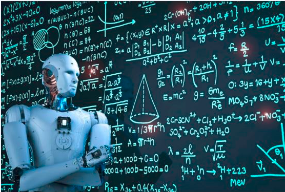

# MachineLearningUsingPython
  
With advancement in computer technology, with more and faster computational power at disposal ___Machine Learning___ has has taken center stage in __disrupting the legacy methods of problem solving__ approach. 

__What does Machine Learning really means?__  
Machine Learning is methodology by which it is possible to empower a computer program/model to take its own decisions based upon what has happened in past. This is done by virtue of providing the data collected to model and verify the test results. 

## Repository 
The given repository showcases the application of various algorithms available as per the problem statement.

## Index

- [Cancer Diagnosis](#section1) 
- [Character Detection](#section2) 
 

### [Cancer Diagnosis](./CancerDiagnosis)
  
- Breast cancer is the most frequent cancer among women, impacting __2.1 million__ women each year, and also causes the __greatest number of cancer-related deaths__ among women
- The best way to treat and overcome Cancer of anytype, and not only Breast Cancer is to diagnoze as early as possible.
- An endaveour to save lives buy predicting breast cancer.
- [Link for the Jupyter notebook](./CancerDiagnosis/Cancer_Diagnosis.ipynb)

### [Character Detection](./CharacterDetection)
  
- __Ghouls, Goblin & Ghosts__ are mostly related with ___halloween___ characters. _Ghouls_ who are considered to be evil spirt, _Goblins_ are mischievous, ugly creatures. _Ghosts_ on other hand are sprits who are yet to take a new form of life.
- The data set here attempts to distinguish between the three characters, based upon the bone,flesh,soul and color
- [Link for the Jupyter notebook](.CharacterDetection/CharacterDetection.ipynb)
